# jomiel

`jomiel` is the meta inquiry middleware for distributed systems. It
returns meta data for content on [video-sharing] websites (e.g.
YouTube) and runs as a service responding to client inquiries.

Two core technologies serve as a basis for `jomiel`:

- [Protocol Buffers] for platform-independent data serialization
- [ZeroMQ] as the messaging library

The client applications can be written in modern [languages][examples]
for most platforms.

`jomiel` is a spiritual successor to (now defunct) [libquvi].



## Features

- Language and platform neutral messaging using [Protocol Buffers] and
  [ZeroMQ]

- A plugin architecture for extending [video-sharing] website support

- Authentication and encryption ([CURVE] and [SSH])

- Runs fully as a service

- Highly configurable

## Getting started

- `jomiel` requires [Python] 3.6+

To install from [PyPI]:

```shell
pip install jomiel        # For the latest release
```

To run from the repository:

```shell
git clone https://github.com/guendto/jomiel.git
cd jomiel
pip install -e .
```

Once you have `jomiel` running, you
can try sending inquiries with:

- [examples] - the demo programs written in most modern languages
- [yomiel] - the pretty printer for `jomiel` messages

### Website coverage

To view the list of the supported [video-sharing] websites, type:

```shell
jomiel --plugin-list
```

The website coverage is still very limited.

- Additional support can be added by writing new plugins
- The plugin architechture is implemented in [Python]
- [Python] is a fun and easy language to learn

See the `src/jomiel/plugin/` directory for the existing plugins.

### When you are contributing new plugins

- Make sure the website is not dedicated to copyright infringement (be that
  they host the media or the link to it)

- Make sure the website is not NSFW

## HOWTO

See [docs/HOWTO](./docs/HOWTO.md).

## License

`jomiel` is licensed under the [Apache License version 2.0][aplv2].

## Acknowledgements

`jomiel` uses [pre-commit] and its many hooks to lint and format the
project files. See the .pre-commit-config.yaml file for details.

### Subprojects (as git subtrees)

- [src/jomiel/comm/](src/jomiel/comm/) of [jomiel-comm]
- [src/jomiel/kore/](src/jomiel/kore/) of [jomiel-kore]

[video-sharing]: https://en.wikipedia.org/wiki/Video_hosting_service
[protocol buffers]: https://developers.google.com/protocol-buffers/
[examples]: https://github.com/guendto/jomiel-examples/
[python]: https://www.python.org/about/gettingstarted/
[jomiel-comm]: https://github.com/guendto/jomiel-comm/
[jomiel-kore]: https://github.com/guendto/jomiel-kore/
[yomiel]: https://github.com/guendto/jomiel-yomiel/
[aplv2]: https://www.tldrlegal.com/l/apache2
[ssh]: https://en.wikipedia.org/wiki/Ssh
[pre-commit]: https://pre-commit.com/
[libquvi]: http://quvi.sf.net/
[curve]: http://curvezmq.org/
[zeromq]: https://zeromq.org/
[pypi]: https://pypi.org/
